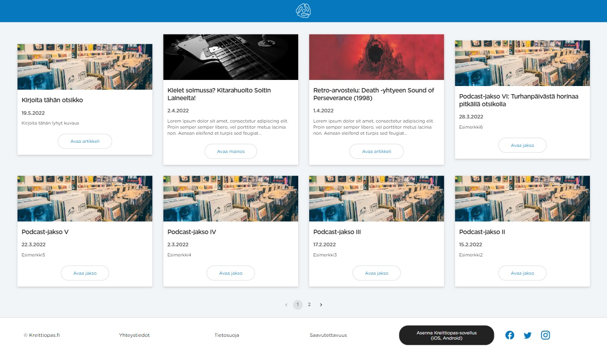
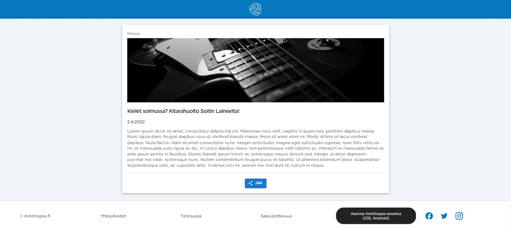
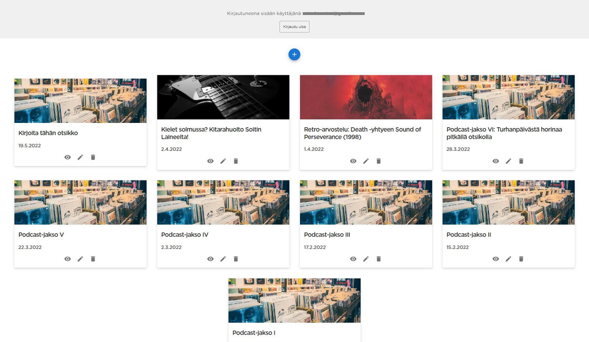
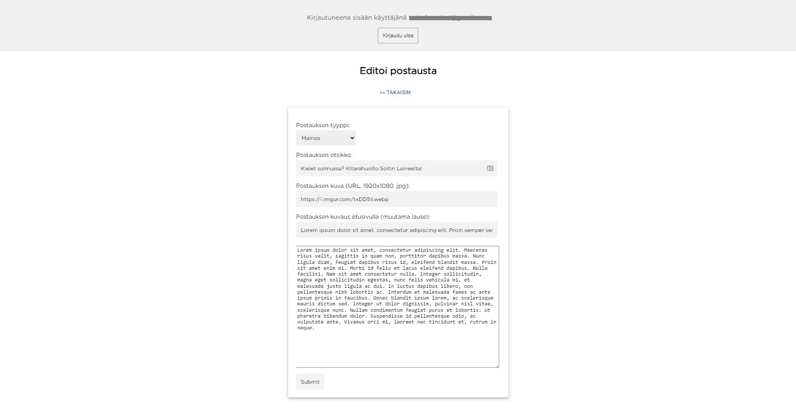
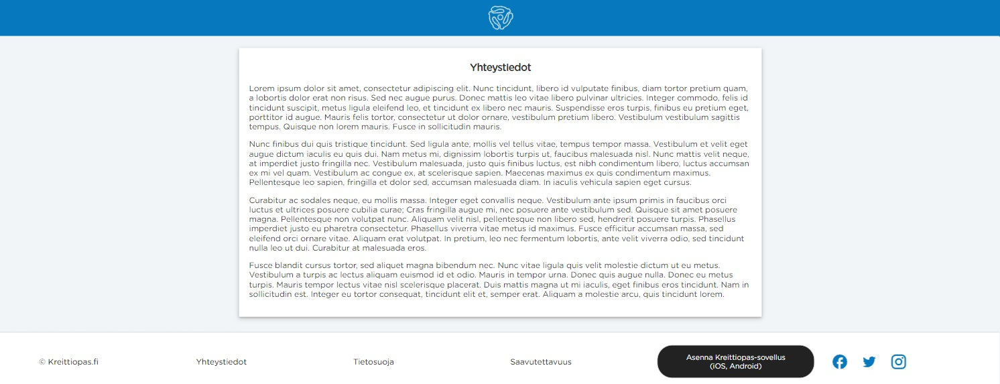

# Kreittiopas Frontend

## Tech used & code explained

I first started this project as my first ever React app, as a simple single-page app. I wanted to develop the site with a reactive, responsive web app mindset; it should work well and fast with both desktop and phones. Figured it would be easier to start my venture in to modern web tech with a React SPA anyways.

[Material UI](https://mui.com/) is used for some of the components, which I were too lazy to code myself. The components should be accessible though, so that is nice. The project itself is not made with a "100% accessible" -mindset.

In the start I used React, snowpack, React-Router, Helmet and some other basic tools of the trade, but decided quickly to move to Next.js and whatever it provided out of the box. This was after learning more and more things about modern web development. Next.js has so much neat stuff which makes a developer's work easier, so I went and ran with that.

After learning more about search engine optimization, I decided to let the feed be a component which is rendered on the client side only. Content would be then rendered server side. This exposes the text to the source code and lets Google bots/crawlers to index pages, so that people can find posts by Googling artist names, song titles, perhaps even dj's names. The feed code is probably not the best solution, and I will continue to learn more better ways to implement such solutions in the future. I am glad though I got it to work according to my way of logic and thinking.

Somewhere along the way I decided to turn it additionally to a Preact app because Preact has a smaller bundle size compared to React. I did the easy and dirty method of just aliasing React to Preact.

Other neat stuff: I changed the files to support TypeScript, and added some very lazy TypeScript typing, mainly because I was not comfortable with TypeScript. It also is a progressive web app, achieved with next-pwa, but not sophisticated enough that it can provide content from the feed to offline cache. Everything else is cached though.

This app was deployed to Google Run. Backend I wrote is an Apollo Server running in Cloud Functions, Node 14 runtime, with GraphQL queries to get data from Firestore. You can find the backend repo from the main branch under the folder "backend".

**I would have liked to** wrote more tests, cleaner code, better component separation to respective folders, neater CSS, but this project was just to get my hands dirty on some codebase, so I did not go to great lengths to refactor the code.

## Pages / ways of interacting with the app

### Posts feed & pagination

- kreittiopas.fi (frontpage)
- kreittiopas/posts/1
- kreittiopas/posts/2
- kreittiopas/posts/3
- etc..

Feed takes a number from the url (or if front page just shows eight newest), passes the number to backend query and gets eight posts per page. Always arranged from newest to old. You can toggle visibility of the posts and they are still in correct order, as the pagination component counts how many visible posts exist.

### One post

- kreittiopas.fi/post/post-title-goes-here-this-is-the-safe-slug/

Gets the post slug from the url, then passes the slug to the backend query and then gets the right post from a collection of documents from Firestore. Takes the markdown and renders it as html.

### Admin panel

- kreittiopas.fi/admin

An admin panel, which allows the user to add, edit, delete posts and toggle the visibility of a post. Pretty much very very basic stuff you would want from a CMS. There is no error handling on adding a post (or: data to the Firestore) which makes the admin panel feel extremely dangerous. Did not implement image uploading, the preferred way of adding a photo is just linking it as a url.

### Static pages

There are a couple of static pages: info, saavutettavuus, tietosuoja, yhteystiedot. Their content will not change hugely and just describe the site to users.

### Spinner logo

A logo to get you to the front page! It is animated and spins like a [7"-single 45rpm record adapter](https://www.google.com/search?q=45+record+adapter&source=lnms&tbm=isch). Probably users will notice it exists and try to click it, and learn that it works to get you back where you were. Or they will think a nav is loading. Anyways..

## Other stuff / perf

Skeleton loading (the "loading" blocks before actual content is gotten from backend) is implemented for getting the feed. This is extremely helpful for user experience as the whole system is deployed to cloud with as little € as possible. As such, it might take a tiny bit of time for the container to start in Cloud Run & Cloud Functions/backend to get data from the database, but as the user browses the website it will get faster. Some data will get cached along the way.

Images for the feed are loaded with placeholder blurs, which makes the perf better for slower connections. The app also has dynamic imports/code splitting for better performance.

The main page has decent Lighthouse scores when deployed to cloud, 100 / 100 / 100 / 100 (desktop), 86 / 100 / 100 / 100 (mobile), these were tested on Google Chrome incognito mode 13th of June 2022.

## Test

No tests currently for this version, I wrote e2e tests at some point for the initial React SPA app with Cypress, but when I converted the app to the final Next/Preact/TypeScript version all of the tests were broken. I decided not to further advance the tests in this project.

## Deployment & env

With Docker you can build and run this project either locally or deploy it to cloud. However, you will need your own dotenv with your own tokens. For cloud deployment I retrieved my variables from Cloud Secrets Manager, which is not gitted in this version.

NEXTAUTH_URL needs to be provided in the Dockerfile as env in order for the auth to work in production, it is not inherited from the dotenv file.

# Launching

If you want to try it out, here is a list of envs that need to be set before it works correctly:

- GOOGLE_CLIENT_ID
- GOOGLE_CLIENT_SECRET
- NEXTAUTH_URL: this should be also in the Dockerfile as ENV if one decides to use Docker
- NEXTAUTH_SECRET
- JWT_SIGNING_PRIVATE_KEY

You also need to:

- add required fonts to `assets`-folder for copyright reasons, I can't provide them
- add your backend url to `apollo-client.js`
- add your google account id to `[...nextauth].js`, or change the provider/logic for auth

Node version which I used when this was made was v17.5.0, you can select it with `nvm use`

Then use:

- `npm install`
- For local development `npm run dev`
- Create a build with `npm build`
- Run that build with `npm start`

And hopefully it works! Thanks for reading.
